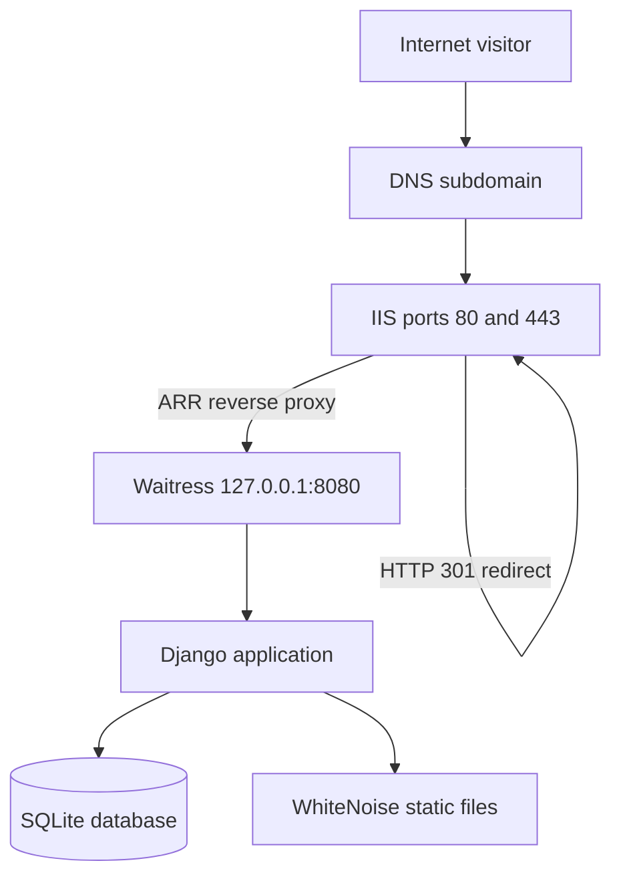

# BuildCore Construction — Django on Windows Server & IIS

[](https://www.python.org/)
[](https://www.djangoproject.com/)
[](https://www.iis.net/)
[](https://letsencrypt.org/)

A production deployment case study for a responsive construction-company website built with Python and Django, then published on Windows Server through Waitress, IIS Application Request Routing (ARR), URL Rewrite, DNS, and automatically renewed HTTPS.

**Live demo:** [https://construction.crysmon.online](https://construction.crysmon.online)

> Portfolio project by Ricardo San Juan. Business information and project records shown on the website are demonstration content.

## Project outcomes

- Built a responsive multi-page construction website with separated Django templates, CSS, and JavaScript.
- Implemented database-driven services, projects, testimonials, quotation requests, contact messages, and newsletter subscriptions.
- Added a quotation workflow with unique references, status history, customer tracking, and Django Admin actions.
- Added read-only REST endpoints, an OpenAPI schema, and Swagger UI.
- Deployed Django on Windows Server using Waitress bound to loopback only.
- Configured IIS as the public reverse proxy with ARR, URL Rewrite, host-header preservation, and SNI bindings.
- Published a DNS subdomain and installed a trusted Let's Encrypt certificate using win-acme.
- Configured automatic application startup and automatic certificate renewal.

## Architecture



Port `8080` is not exposed publicly. IIS accepts public HTTP/HTTPS traffic and forwards application requests internally to Waitress.

## Technology stack

| Layer | Technology |
|---|---|
| Backend | Python 3.12, Django 6.0 |
| API | Django REST Framework, drf-spectacular |
| Frontend | Django templates, HTML, CSS, JavaScript |
| Database | Dedicated SQLite database (`db.sqlite3`) |
| Static files | WhiteNoise |
| Windows WSGI server | Waitress |
| Reverse proxy | IIS 10, ARR 3, URL Rewrite 2 |
| TLS | Let's Encrypt through win-acme |
| Process startup | Windows Task Scheduler |

## Application features

- Responsive home, about, services, projects, contact, privacy, and project-detail pages
- Quotation form with validation and automatic `BC-YYYYMM-XXXX` reference
- Secure quotation tracking using reference number and customer email
- Status timeline and admin workflow actions
- Django Admin content management
- Contact inbox and newsletter subscriber records
- Read-only APIs for services, projects, and testimonials
- Swagger UI at `/api/docs/`
- Demo-data management command and automated tests

## Repository layout

```text
.
├── README.md
├── docs/
│   ├── WINDOWS_SERVER_DEPLOYMENT.md
│   ├── TROUBLESHOOTING.md
│   └── screenshots/
├── deployment/iis/web.config.example
└── django_site/
    ├── manage.py
    ├── requirements.txt
    ├── buildcore/
    ├── core/
    ├── templates/
    └── static/
```

## Local setup

```powershell
git clone https://github.com/nomecir05/django_site.git
cd django_site\django_site
py -m venv venv
Set-ExecutionPolicy -Scope Process -ExecutionPolicy Bypass
.\venv\Scripts\Activate.ps1
python -m pip install -r requirements.txt
Copy-Item .env.example .env
python manage.py migrate
python manage.py seed_demo
python manage.py createsuperuser
python manage.py runserver
```

Open `http://127.0.0.1:8000/` and `http://127.0.0.1:8000/admin/`.

## Verification

The published repository was checked with:

```powershell
python manage.py check
python manage.py test
```

Result at portfolio preparation time: Django system checks passed and all seven automated tests passed.


The screenshot above confirms that the public subdomain is protected by a trusted Let's Encrypt certificate.

## Production documentation

- [Windows Server, Waitress, IIS, DNS, and HTTPS deployment](docs/WINDOWS_SERVER_DEPLOYMENT.md)
- [Troubleshooting record and lessons learned](docs/TROUBLESHOOTING.md)
- [IIS reverse-proxy configuration example](deployment/iis/web.config.example)
- [Detailed application documentation](django_site/README.md)

## Security notes

- Real `.env` files, passwords, database files, certificates, and private keys must never be committed.
- `.gitignore` excludes `.env`, virtual environments, SQLite data, collected static files, and uploaded media.
- BuildCore uses its own SQLite database and does not share a database connection with another website.
- `DEBUG=False`, host allowlisting, trusted CSRF origins, secure cookies, HSTS, HTTPS, and a unique secret key are required in production.
- Email SMTP setup is intentionally deferred until a dedicated construction-company mailbox is available.

## Deployment status

- Public site: online
- IIS reverse proxy: active
- HTTPS: active
- Certificate renewal: automatic
- Application startup: automatic
- SMTP email delivery: pending dedicated mailbox setup
